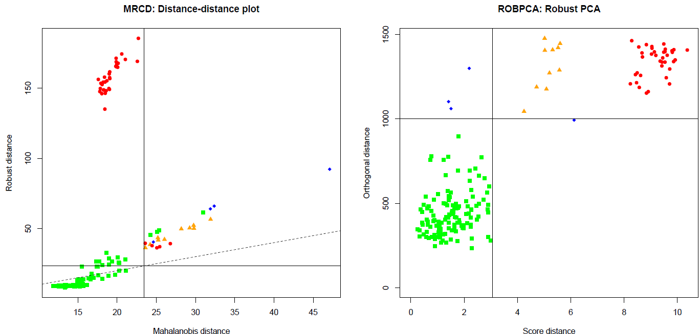
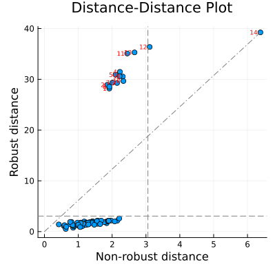

# Robustbase

[](https://github.com/valentint/Robustbase.jl/actions/workflows/CI.yml?query=branch%3Amain)
[](http://codecov.io/github/valentint/Robustbase.jl?branch=main)
[](https://valentint.github.io/Robustbase.jl/dev/)

<!--  -->

The package `Robustbase` provides "Essential" Robust Statistics - tools allowing to analyze data with robust methods: univariate methods, multivariate statistics and regression. We strive to cover the book "Robust Statistics, Theory and Methods (with R)" by 'Maronna, Martin, Yohai and Salibian-Barrera'; Wiley 2019. The package is based on the R packages `robustbase` and `rrcov`.

## Installation

The package Robustbase can be installed using the Julia REPL as follows

```
julia> ]
(@v1.12) pkg> add Robustbase
```

or

```
julia> using Pkg
julia> Pkg.add("Robustbase")
```

and then

```
julia> using Robustbase
```
to make it available to the user.

## Documentation
Please check out the reference manual [here](https://valentint.github.io/Robustbase.jl/dev/).

## Functionalities

### 1. Univariate statistics
The univariate module contains several univariate location and scale estimators. 
They all implement the abstract base class `RobustScale`, which has
the properties `location` and `scale` and can be fitted using the `fit!` method. Each 
class is expected to implement a `_calculate` method where the attributes `scale_` and
`location_` are set.
All functions have matrix versions which can be called on a matrix or a data frame
specifying the required dimension on which to do the calculations.

#### Example 
Let's have the following 10 observations. The classical methods for estimating 
the parameters of the model, the arithmetic mean and standard deviation, may be
affected by outliers.
```julia
x = [9.52, 9.68, 10.16, 9.96, 10.08, 9.99, 10.47, 9.91, 9.92, 15.21]
mean(x)
std(x)
```
|Estimator      |All 10 observations| Only 9 regular observations |
|---------------|:-----------------:|:---------------------------:|
|$\bar x_n$     |10.49              |9.97                         |
|$median$       |9.98               |9.96                         |
|$\tau-location$|9.96               |9.96                         |
|               |                   |                             |
|$Stdev_n$      |1.68               |0.27                         |
|$IQRN$         |0.17               |0.13                         |
|$MAD$          |0.21               |0.18                         |
|$\tau-scale$   |0.28               |0.22                         |
|$Q_n-scale$    |0.37               |0.31                         |
 
### 2. Covariance
Similarly as in the univariate case outliers can influence the 
estimators of multivariate data, these are in first line the 
multivariate location and covariance esimators. Apart from 
being useful for outlier detection through computing the Mahalanobis distances,
they are cornerstones of many other multivariate methods 
like principal component analysis and discriminant analysis.
The most popular robust estimator of multivariate location 
and covariance is the Minimum Covariance Determinant (MCD) 
estimator of Rousseeuw (1084) which is widely used 
after the fast algorithm of Rousseeuw and van Driessen (1999) became 
available. A faster version of the MCD is the deterministic MCD of 
Hubert, Rousseeuw and Verdonck (2012) which instead of doing 
time consuming resampling starts from six rough robust 
estimators which are easy to compute. 

The covariance module implements curently three frequently 
used scatter estimators: The Fast MCD, the deterministic MCD and the OGK.
They all use the new abstract base class `RobustCovariance`
which extends the `CovarianceEstimator` class from `StatsBase`.
The RobustCovariance class includes the distance-distance plot. 
It shows the robust distances versus the classical Mahalanobis 
distances, and is equipped with thresholds for outlier detection.
The plot is drawn by the `dd_plot()` function
function, after obtaining a robust covariance estimator by the `fit!()` 
method.

#### Example

```{julia}
mcd = CovMcd();
fit!(mcd, hbk[:, 1:3]);
display(mcd)
dd_plot(mcd)
```
```
-> Method:  Fast MCD Estimator: (alpha=0.5 ==> h=39)

Robust estimate of location:
[1.55833, 1.80333, 1.66]

Robust estimate of covariance:
3×3 Matrix{Float64}:
 1.21312    0.0239154  0.165793
 0.0239154  1.22836    0.195735
 0.165793   0.195735   1.12535
```
<!-- -->

### 3. Data sets
`Robustbase` includes several datasets that are often used in the robustness literature.
These datasets serve as standard examples and benchmarks, allowing users to easily test
robust algorithms. They are also available in the R-packages `robustbase` and `rrcov`.

### 4. Further development
- Add S- and MM-estimators of multivariate location and covariance matrix
- Add regression analysis: Least Trimmed Squares regression
- Add Principal component analysis
- Add Discriminant analysis

## Community guidelines

### Report issues and request features

If you experience any bugs or issues or if you have any suggestions for
additional features, please submit an issue via the
[*Issues*](https://github.com/valentint/Robustbase/issues) tab of this
repository. Please have a look at existing issues first to see if your
problem or feature request has already been discussed.

### Contribute to the package

If you want to contribute to the package, you can fork this repository
and create a pull request after implementing the desired functionality.

### Ask for help

If you need help using the package, or if you are interested in
collaborations related to this project, please get in touch with the
package maintainer.
